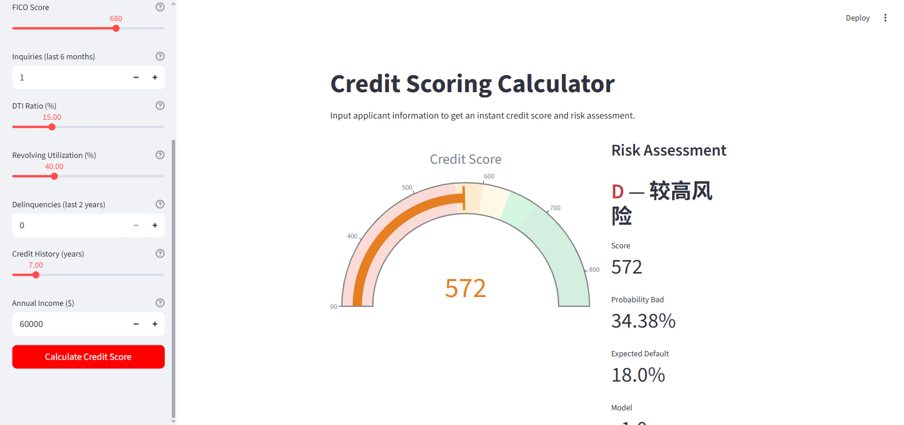
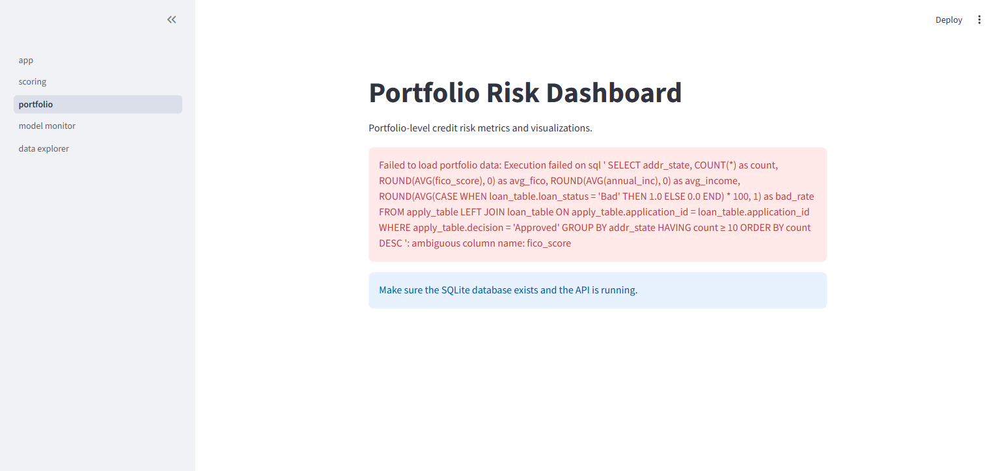
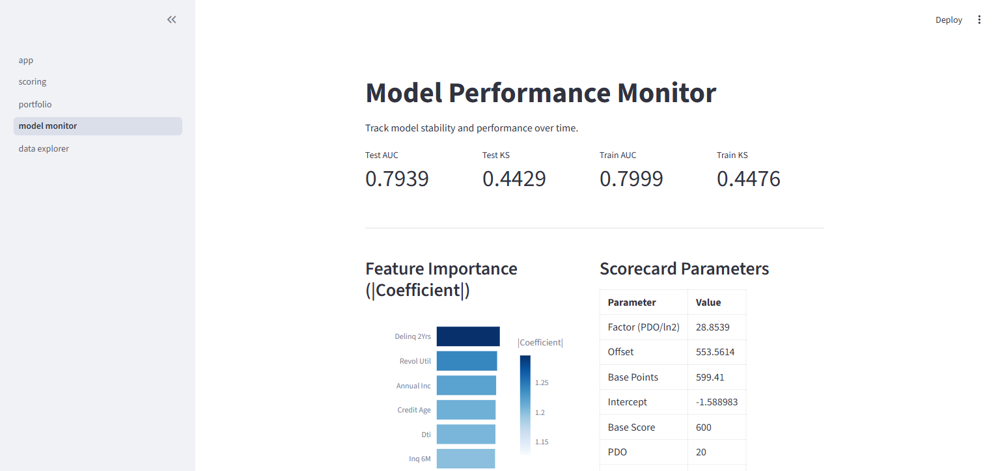
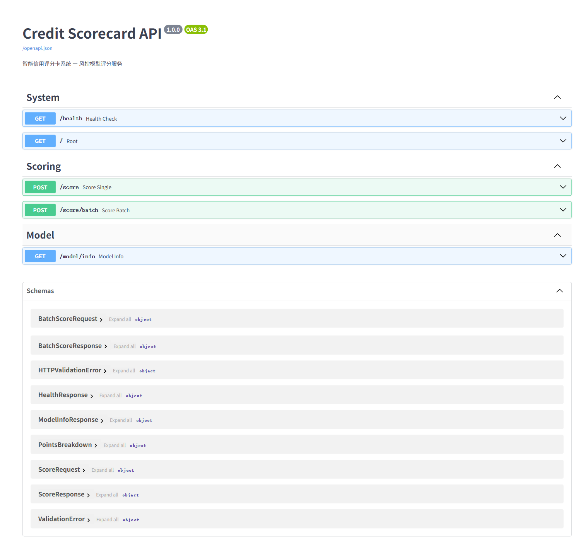

# Credit Scorecard System

智能信用评分卡系统 — 基于逻辑回归的标准评分卡模型，用于消费金融/银行零售信贷审批。

## 项目概述

本项目是完整的金融风控评分卡系统，从数据仓库搭建到模型部署全链路覆盖。采用行业标准的 **WOE (Weight of Evidence) 编码 + 逻辑回归 + PDO 评分转换** 方法论，输出可直接用于信贷审批决策的信用评分（300-850）。

### 技术栈

| 层级 | 技术 | 用途 |
|------|------|------|
| 数据层 | SQLite + pandas | 风控数仓，50k 借贷记录 |
| 特征工程 | ChiMerge 分箱 + WOE/IV | 变量分箱、证据权重编码 |
| 模型层 | scikit-learn LogisticRegression | 评分卡核心模型 |
| API 层 | FastAPI + Pydantic | 模型服务化，RESTful API |
| 可视化 | Streamlit + Plotly | 交互式风控仪表盘 |
| 序列化 | joblib | 模型与分箱映射持久化 |

### 模型性能

| 指标 | 训练集 | 测试集 |
|------|--------|--------|
| AUC | 0.7999 | 0.7939 |
| KS | 0.4476 | 0.4429 |
| 入模特征 | 7 个 | — |

### 风险等级

| 等级 | 分数区间 | 描述 | 预期违约率 |
|------|----------|------|------------|
| A | 680+ | 极低风险 | 5% |
| B | 640-680 | 低风险 | 8% |
| C | 600-640 | 中等风险 | 12% |
| D | 560-600 | 较高风险 | 18% |
| E | <560 | 高风险 | 30% |

## 项目结构

```
credit-scorecard/
├── config.py                 # 项目配置（评分卡参数、风险等级）
├── requirements.txt          # Python 依赖
│
├── data/
│   ├── raw/                  # 原始合成数据 (50k)
│   ├── processed/            # WOE 编码数据 + 图表 + 报告
│   ├── artifacts/            # 模型产出物（joblib序列化）
│   └── risk_db.sqlite        # SQLite 风控数仓
│
├── src/
│   ├── data_loader.py        # Phase 1: 数据生成与数仓搭建
│   ├── phase3_feature_engineering.py  # Phase 3: 特征工程与WOE/IV
│   └── phase4_model_building.py       # Phase 4: 模型构建与评分卡转换
│
├── api/
│   ├── main.py               # FastAPI 应用入口
│   ├── scorer.py             # 核心评分引擎
│   ├── schemas.py            # Pydantic 请求/响应模型
│   └── config.py             # API 配置
│
├── dashboard/
│   ├── app.py                # Streamlit 主入口
│   ├── api_client.py         # FastAPI 客户端封装
│   └── pages/
│       ├── 01_scoring.py     # 评分计算器（核心页面）
│       ├── 02_portfolio.py   # 组合资产仪表盘
│       ├── 03_model_monitor.py  # 模型监控（KS/PSI/WOE）
│       └── 04_data_explorer.py  # 数据探索与SQL查询
│
├── run_api.bat               # 一键启动 API
├── run_dashboard.bat         # 一键启动仪表盘
└── run_all.bat               # 同时启动 API + 仪表盘
```

## 界面展示

### 评分计算器


### 组合资产仪表盘


### 模型监控


### API Swagger 文档


---

## 快速开始

### 在线演示 (Streamlit Cloud)

点击即可体验评分功能：**[Live Demo](https://YOUR-APP-NAME.streamlit.app)** *(部署后更新链接)*

### 本地运行

**环境要求**: Python 3.8+, Windows / macOS / Linux

```bash
# 1. 安装依赖
pip install -r requirements.txt

# 2. 训练模型 (生成模型产出物)
python src/phase4_model_building.py

# 3. 一键启动 (推荐)
# Windows: 双击 run_all.bat
# 或手动:
uvicorn api.main:app --host 127.0.0.1 --port 8000 --reload    # 终端1
streamlit run dashboard/app.py --server.port 8501              # 终端2
```

### 访问地址

| 服务 | 地址 |
|------|------|
| 仪表盘 | http://127.0.0.1:8501 |
| API 文档 | http://127.0.0.1:8000/docs |
| 独立演示版 | `streamlit run app_cloud.py` |

---

## 部署到 Streamlit Cloud

1. 将项目推送到 GitHub 仓库
2. 访问 [share.streamlit.io](https://share.streamlit.io)
3. 点击 "New app"，选择仓库，Main file path 填 `app_cloud.py`
4. 点击 Deploy，几分钟后即可获得公开链接

`app_cloud.py` 是独立版本，内嵌评分引擎，无需 FastAPI 后端即可运行。

## API 端点

| 方法 | 路径 | 描述 |
|------|------|------|
| GET | `/health` | 健康检查 |
| POST | `/score` | 单个申请人评分 |
| POST | `/score/batch` | 批量评分（上限100） |
| GET | `/model/info` | 模型元数据 |
| GET | `/docs` | Swagger 交互式文档 |

### 评分请求示例

```bash
curl -X POST http://127.0.0.1:8000/score \
  -H "Content-Type: application/json" \
  -d '{
    "fico_score": 720,
    "inq_6m": 1,
    "dti": 12.5,
    "revol_util": 30.0,
    "delinq_2yrs": 0,
    "credit_age": 10.0,
    "annual_inc": 85000
  }'
```

### 评分响应示例

```json
{
  "score": 655,
  "grade": "B",
  "grade_description": "低风险",
  "expected_default_rate": 0.08,
  "probability_bad": 0.0556,
  "points_breakdown": {
    "base_points": 599.41,
    "features": {
      "fico_score": 28.5,
      "inq_6m": -4.0,
      "dti": 0.5,
      "revol_util": 5.1,
      "delinq_2yrs": 4.0,
      "credit_age": -1.3,
      "annual_inc": 5.6
    },
    "total": 655.0
  },
  "model_version": "v1.0",
  "timestamp": "2026-05-29T16:43:00+08:00"
}
```

## 入模特征 (7个)

| 特征 | IV 值 | 预测力评级 |
|------|-------|-----------|
| FICO Score | 0.5832 | Suspicious (需检查) |
| Inquiries (6m) | 0.1458 | Medium |
| DTI | 0.1410 | Medium |
| Revolving Util | 0.0985 | Weak |
| Delinquencies (2yr) | 0.0859 | Weak |
| Credit Age | 0.0702 | Weak |
| Annual Income | 0.0546 | Weak |

## 核心方法论

### 评分卡转换公式

```
Factor = PDO / ln(2) ≈ 28.85
Offset = BASE_SCORE - Factor × ln(BASE_ODDS)
Score  = Offset - Factor × intercept - Factor × Σ(coefᵢ × WOEᵢ)
```

- **Base Score**: 600
- **PDO (Points to Double Odds)**: 20 — 分数每增加20分，好坏比(odds)翻倍
- **Base Odds**: 5 — 在600分时，5个好客户对应1个坏客户

### 为什么用 WOE 编码？

1. 把特征与目标的非线性关系转化为线性（逻辑回归的线性假设）
2. 对缺失值和极端值不敏感（缺失值作为独立一箱，WOE=0）
3. 业务可解释 — 每个分箱的WOE值直观反映该组的好坏倾向
4. 监管合规 — 评分卡表（每个bin几分）可直接报备监管

### 变量筛选流程

```
11个数值特征 + 2个衍生特征
  → IV 筛选 (>0.02)
  → 相关性检查 (<0.7)
  → VIF 多重共线性检查 (<10, 高IV变量保护)
  → WOE 单调性验证
  → 最终7个特征入模
```

## 仪表盘功能

1. **评分计算器** — 输入申请人7项信息，实时输出信用分+风险等级+分数拆解
2. **组合仪表盘** — 总申请量/通过率/均分/坏账率 + 分数分布 + 风险等级分布 + 地理分析
3. **模型监控** — KS统计 + 特征重要性 + WOE曲线查看 + 完整评分卡表
4. **数据探索** — 三表浏览 + 安全SQL查询（SELECT only）+ 统计数据导出

## 简历要点

本项目展示了以下能力：

- **金融风控领域知识**: 评分卡方法论（WOE/IV/PDO/KS/PSI），好坏客户定义（M3+），时间窗口设计
- **机器学习工程**: 特征工程管道、逻辑回归建模、模型评估（AUC/KS/混淆矩阵）
- **全栈开发**: FastAPI RESTful API + Streamlit 交互式仪表盘
- **模型部署**: joblib 序列化、模型服务化、评分引擎实时推理
- **数据工程**: SQLite 数仓设计、ETL 管道、SQL 查询优化

适合投递：风控建模、数据科学、机器学习工程、金融科技等岗位。

## License

MIT
